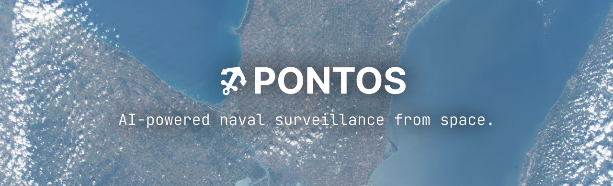

<div align="center">


</div>

Pontos is a production-ready AI-powered ship detection system that combines Sentinel-2 satellite imagery with YOLO11s deep learning to automatically identify and geolocate naval vessels worldwide.

Named after **Pontos** (Πόντος), the primordial Greek god of the sea. Just as Pontos embodied the vast ocean connecting all lands, this project monitors global maritime activity from space, watching the seas from the heavens.

---

## Table of Contents

- [Overview](#overview)
- [Features](#features)
- [Architecture](#architecture)
- [Installation](#installation)
  - [Prerequisites](#prerequisites)
  - [Standard Installation](#standard-installation)
  - [Docker Installation](#docker-installation)
- [Quick Start](#quick-start)
- [Usage](#usage)
  - [Command Line Interface](#command-line-interface)
  - [Python API](#python-api)
- [Configuration](#configuration)
- [Development](#development)
  - [Setup Development Environment](#setup-development-environment)
  - [Code Quality](#code-quality)
- [Testing](#testing)
- [Deployment](#deployment)
- [Project Structure](#project-structure)
- [Examples](#examples)
- [Contributing](#contributing)
- [License](#license)
- [Acknowledgments](#acknowledgments)

---

## Overview

Pontos automates the detection of ships in satellite imagery by integrating:

1. **Sentinel-2 Data Acquisition**: Downloads high-resolution RGB satellite scenes via Sentinel Hub API
2. **AI-Powered Detection**: YOLO11s marine vessel detection model (19MB pre-trained weights)
3. **Geospatial Processing**: Converts pixel-space detections to geographic coordinates (WGS84)
4. **GeoJSON Export**: Outputs vessel locations as industry-standard GeoJSON for mapping applications

The system has been validated on the Toulon French naval base, successfully detecting 10+ vessels with 97% test coverage.

---

## Features

- **Real-Time Ship Detection**: YOLO11s model optimized for marine vessels
- **Satellite Integration**: Direct Sentinel-2 L1C imagery download via Sentinel Hub
- **GPU Acceleration**: Automatic GPU/CPU fallback with ROCm and CUDA support
- **Geospatial Accuracy**: Precise pixel-to-coordinate transformation using PyProj
- **Production-Ready**: 97% test coverage, CI/CD pipeline, Docker support
- **Command Line Interface**: Single-command operation for quick scans
- **Extensible API**: Python package with modular components
- **Cloud Coverage Filtering**: Configurable threshold for image quality
- **Batch Processing**: Multi-image detection support
- **Interactive Examples**: Jupyter notebook and demo scripts included

---

## Architecture

```
┌─────────────────────────────────────────────────────────────┐
│                      Pontos CLI / API                       │
└─────────────────────┬───────────────────────────────────────┘
                      │
          ┌───────────┴───────────┐
          │                       │
┌─────────▼─────────┐   ┌────────▼────────┐
│ SentinelDataSource│   │  VesselDetector  │
│   (sentinel.py)   │   │  (detector.py)   │
│                   │   │                  │
│ • Sentinel Hub API│   │ • YOLO11s Model  │
│ • Bbox queries    │   │ • GPU/CPU        │
│ • L1C RGB         │   │ • Confidence     │
└─────────┬─────────┘   └────────┬─────────┘
          │                      │
          │   ┌──────────────────┘
          │   │
┌─────────▼───▼─────────┐
│     GeoExporter       │
│      (geo.py)         │
│                       │
│ • Coordinate transform│
│ • GeoJSON export      │
│ • Bbox validation     │
└───────────────────────┘
```

### Core Components

- **`pontos.cli`**: Click-based command-line interface
- **`pontos.config`**: Configuration management with environment variable support
- **`pontos.detector`**: YOLO11s wrapper for ship detection
- **`pontos.sentinel`**: Sentinel Hub API client for satellite data
- **`pontos.geo`**: Geospatial coordinate transformation and GeoJSON generation

---

## Installation

### Prerequisites

- **Python**: 3.12 or higher
- **Sentinel Hub Account**: Register at [Sentinel Hub](https://www.sentinel-hub.com/)
  - Create OAuth credentials (Client ID and Secret)
- **GPU (Optional)**: NVIDIA (CUDA) or AMD (ROCm) for accelerated inference

### Standard Installation

```bash
# Clone the repository
git clone https://github.com/teyk0o/pontos.git
cd pontos

# Install package in editable mode
pip install -e .

# Or install from requirements
pip install -r requirements.txt
```

### Docker Installation

```bash
# Build the Docker image (ROCm-based GPU support)
docker build -f docker/Dockerfile -t pontos:latest .

# Run with GPU support
docker run --device=/dev/kfd --device=/dev/dri pontos:latest pontos scan --help

# Run CPU-only
docker run pontos:latest pontos scan --help
```

---

## Quick Start

1. **Configure Credentials**

```bash
# Copy environment template
cp .env.example .env

# Edit .env with your Sentinel Hub credentials
export SH_CLIENT_ID="your-client-id"
export SH_CLIENT_SECRET="your-client-secret"
```

2. **Run a Detection Scan**

```bash
# Scan Toulon naval base (January 2026)
pontos scan \
  --bbox 5.85,43.08,6.05,43.18 \
  --date-start 2026-01-01 \
  --date-end 2026-01-31 \
  --output vessels.geojson \
  --conf 0.05
```

3. **View Results**

The output `vessels.geojson` can be visualized in:
- QGIS
- [geojson.io](https://geojson.io)
- Folium (Python)
- Any GIS application supporting GeoJSON

---

## Usage

### Command Line Interface

```bash
pontos scan [OPTIONS]
```

**Options:**

| Option | Type | Default | Description |
|--------|------|---------|-------------|
| `--bbox` | TEXT | Required | Bounding box as `min_lon,min_lat,max_lon,max_lat` (WGS84) |
| `--date-start` | TEXT | Required | Start date in `YYYY-MM-DD` format |
| `--date-end` | TEXT | Required | End date in `YYYY-MM-DD` format |
| `--output` | PATH | `vessels.geojson` | Output GeoJSON file path |
| `--conf` | FLOAT | `0.05` | Detection confidence threshold (0.0-1.0) |

**Example:**

```bash
# Detect vessels in San Diego harbor
pontos scan \
  --bbox -117.25,32.65,-117.15,32.75 \
  --date-start 2026-01-15 \
  --date-end 2026-01-20 \
  --output san_diego_vessels.geojson \
  --conf 0.1
```

### Python API

```python
from pontos import SentinelDataSource, VesselDetector, GeoExporter, config
from PIL import Image

# Configure
config.sh_client_id = "your-client-id"
config.sh_client_secret = "your-client-secret"

# 1. Download satellite imagery
sentinel = SentinelDataSource()
bbox = (5.85, 43.08, 6.05, 43.18)  # Toulon, France
image_path = sentinel.download_scene(
    bbox=bbox,
    date_start="2026-01-01",
    date_end="2026-01-31"
)

# 2. Detect vessels
detector = VesselDetector(model_path="models/yolo11s_tci.pt")
image = Image.open(image_path)
results = detector.detect(image, conf=0.05, visualize=True)

# 3. Export to GeoJSON
exporter = GeoExporter(bbox=bbox, image_size=(1024, 1024))
geojson = exporter.export_geojson(results, output_path="vessels.geojson")

print(f"Detected {len(results)} vessels")
print(f"Using device: {detector.device}")
```

---

## Configuration

Pontos can be configured via environment variables or programmatically.

### Environment Variables

Create a `.env` file in the project root:

```bash
# Sentinel Hub Credentials (Required)
SH_CLIENT_ID=your-client-id
SH_CLIENT_SECRET=your-client-secret

# Model Configuration
MODEL_PATH=models/yolo11s_tci.pt
DEVICE=0  # GPU device ID or 'cpu'
CONFIDENCE_THRESHOLD=0.05

# Processing Parameters
PATCH_SIZE=1024
PATCH_OVERLAP=0.1
MAX_WORKERS=4
BATCH_SIZE=8
```

### Programmatic Configuration

```python
from pontos import config

config.sh_client_id = "your-client-id"
config.sh_client_secret = "your-client-secret"
config.model_path = "models/yolo11s_tci.pt"
config.device = "0"  # Use first GPU
config.confidence_threshold = 0.1
```

### Configuration Reference

| Variable | Type | Default | Description |
|----------|------|---------|-------------|
| `SH_CLIENT_ID` | str | None | Sentinel Hub OAuth Client ID |
| `SH_CLIENT_SECRET` | str | None | Sentinel Hub OAuth Client Secret |
| `MODEL_PATH` | str | `models/yolo11s_tci.pt` | Path to YOLO model weights |
| `DEVICE` | str | `cpu` | Computation device (`cpu`, `0`, `1`, etc.) |
| `CONFIDENCE_THRESHOLD` | float | `0.05` | Minimum detection confidence |
| `PATCH_SIZE` | int | `1024` | Image patch size for tiled detection |
| `PATCH_OVERLAP` | float | `0.1` | Overlap ratio for tiled detection |
| `MAX_WORKERS` | int | `4` | Maximum parallel workers |
| `BATCH_SIZE` | int | `8` | Batch size for inference |

---

## Development

### Setup Development Environment

```bash
# Clone repository
git clone https://github.com/teyk0o/pontos.git
cd pontos

# Create virtual environment
python -m venv venv
source venv/bin/activate  # On Windows: venv\Scripts\activate

# Install development dependencies
pip install -r requirements.txt
pip install -e .

# Install pre-commit hooks (optional)
pre-commit install
```

### Code Quality

**Formatting:**

```bash
# Format code with Black
black pontos tests

# Check formatting
black --check pontos tests
```

**Linting:**

```bash
# Lint with Ruff
ruff check pontos tests

# Auto-fix issues
ruff check --fix pontos tests
```

**Type Checking:**

```bash
# Run mypy (if configured)
mypy pontos
```

---

## Testing

Pontos has 97% test coverage with comprehensive unit and integration tests.

**Run All Tests:**

```bash
pytest
```

**Run with Coverage:**

```bash
pytest --cov=pontos --cov-report=html
```

**Run Specific Test Categories:**

```bash
# Integration tests only
pytest -m integration

# Slow tests only
pytest -m slow

# Exclude slow tests
pytest -m "not slow"
```

**Test Structure:**

```
tests/
├── conftest.py           # Pytest fixtures (mock data, images)
├── test_cli.py           # CLI command tests
├── test_config.py        # Configuration validation
├── test_detector.py      # YOLO detection tests
├── test_geo.py           # Geospatial transformation tests
└── test_sentinel.py      # Sentinel Hub API tests
```

**Coverage Report:**

Open `htmlcov/index.html` after running coverage tests to view detailed line-by-line coverage.

---

## Deployment

### GitHub Actions CI/CD

The project includes automated testing and linting via GitHub Actions (`.github/workflows/tests.yml`).

**Workflow Jobs:**

1. **Tests & Coverage**: Runs pytest with coverage on Python 3.12
2. **Lint**: Validates code formatting (Black) and linting (Ruff)

**Codecov Integration:**

Coverage reports are automatically uploaded to Codecov after successful test runs.

### Docker Deployment

**Build Production Image:**

```bash
docker build -f docker/Dockerfile -t pontos:latest .
```

**Run Container:**

```bash
# With environment file
docker run --env-file .env pontos:latest pontos scan --bbox 5.85,43.08,6.05,43.18 --date-start 2026-01-01 --date-end 2026-01-31

# With inline environment variables
docker run \
  -e SH_CLIENT_ID=your-id \
  -e SH_CLIENT_SECRET=your-secret \
  pontos:latest pontos scan --bbox 5.85,43.08,6.05,43.18 --date-start 2026-01-01 --date-end 2026-01-31
```

**GPU Support:**

The Docker image is based on ROCm 7.2 + PyTorch 2.7.1 for AMD GPU acceleration.

```bash
# AMD GPU (ROCm)
docker run --device=/dev/kfd --device=/dev/dri pontos:latest

# NVIDIA GPU (CUDA) - requires nvidia-docker
docker run --gpus all pontos:latest
```

---

## Project Structure

```
pontos/
├── pontos/                    # Main package
│   ├── __init__.py           # Package exports
│   ├── cli.py                # Click CLI
│   ├── config.py             # Configuration management
│   ├── detector.py           # YOLO11s vessel detector
│   ├── sentinel.py           # Sentinel Hub client
│   └── geo.py                # Geospatial utilities
│
├── tests/                     # Test suite (97% coverage)
│   ├── conftest.py           # Pytest fixtures
│   ├── test_cli.py
│   ├── test_config.py
│   ├── test_detector.py
│   ├── test_geo.py
│   └── test_sentinel.py
│
├── examples/                  # Usage examples
│   └── toulon_demo.py        # Complete pipeline demo
│
├── docker/                    # Container configuration
│   └── Dockerfile            # ROCm-based GPU image
│
├── models/                    # Pre-trained models
│   └── yolo11s_tci.pt        # YOLO11s marine vessel weights
│
├── data/                      # Data directory
│   └── samples/
│       └── toulon_l1c.png    # Sample satellite image
│
├── .github/
│   └── workflows/
│       └── tests.yml         # CI/CD pipeline
│
├── setup.py                  # Package configuration
├── requirements.txt          # Dependencies
├── requirements.lock         # Locked versions
├── pytest.ini                # Pytest configuration
├── .env.example              # Environment template
└── README.md                 # This file
```

---

## Examples

### Toulon Naval Base Detection

Run the included demo script:

```bash
python examples/toulon_demo.py
```

This script:
1. Downloads Sentinel-2 imagery of Toulon harbor
2. Runs vessel detection with YOLO11s
3. Exports detected ships to GeoJSON
4. Displays results summary

### Custom Area Scanning

```python
from pontos import SentinelDataSource, VesselDetector, GeoExporter, config
from PIL import Image

# Configure
config.sh_client_id = "your-client-id"
config.sh_client_secret = "your-client-secret"

# Define area of interest (San Diego)
bbox = (-117.25, 32.65, -117.15, 32.75)

# Download imagery
sentinel = SentinelDataSource()
image_path = sentinel.download_scene(
    bbox=bbox,
    date_start="2026-01-01",
    date_end="2026-01-15"
)

# Detect vessels
detector = VesselDetector()
image = Image.open(image_path)
results = detector.detect(image, conf=0.1, visualize=True)

# Export results
exporter = GeoExporter(bbox=bbox, image_size=(1024, 1024))
geojson = exporter.export_geojson(results, output_path="san_diego_vessels.geojson")

print(f"Found {len(results)} vessels in San Diego harbor")
```

---

## Contributing

Contributions are welcome. Please follow these guidelines:

1. **Code Style**: Use Black for formatting and Ruff for linting
2. **Testing**: Maintain 90%+ test coverage for new code
3. **Documentation**: Add docstrings to all public functions/classes
4. **Commits**: Follow [Conventional Commits](https://www.conventionalcommits.org/) specification
5. **Branches**: Use `type/scope/short-description` format (e.g., `feat/vessel-tracking`)
6. **Pull Requests**: Include tests and update documentation

**Development Workflow:**

```bash
# Create feature branch
git checkout -b feat/new-feature

# Make changes and test
pytest --cov=pontos

# Format and lint
black pontos tests
ruff check --fix pontos tests

# Commit with conventional format
git commit -m "feat: add tiled detection support"

# Push and create PR
git push origin feat/new-feature
```

---

## License

This project is licensed under the MIT License. See the `LICENSE` file for details.

---

## Acknowledgments

- **Sentinel Hub**: Satellite imagery API
- **Ultralytics**: YOLO11s object detection framework
- **ESA Copernicus**: Sentinel-2 satellite data
- **PyTorch**: Deep learning framework
- **Contributors**: All contributors to this project

---

**Maintained by**: Teyk0o

**Project Homepage**: https://github.com/teyk0o/pontos

**Issue Tracker**: https://github.com/teyk0o/pontos/issues
