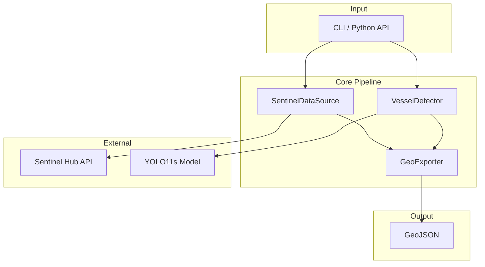

# Pontos

**AI-powered ship detection system using Sentinel-2 satellite imagery and YOLO11s**

---

## Overview

**Pontos** is a production-ready AI-powered ship detection system that combines Sentinel-2 satellite imagery with YOLO11s deep learning to automatically identify and geolocate naval vessels worldwide.

Named after **Pontos** (Πόντος), the primordial Greek god of the sea. Just as Pontos embodied the vast ocean connecting all lands, this project monitors global maritime activity from space, watching the seas from the heavens.

<div class="grid cards" markdown>

-   :material-satellite-variant:{ .lg .middle } __Satellite Integration__

    ---

    Direct Sentinel-2 L1C imagery download via Sentinel Hub API with cloud coverage filtering

-   :material-brain:{ .lg .middle } __AI-Powered Detection__

    ---

    YOLO11s model optimized for marine vessel detection with GPU acceleration support

-   :material-map-marker:{ .lg .middle } __Geospatial Accuracy__

    ---

    Precise pixel-to-coordinate transformation using PyProj with GeoJSON export

-   :material-docker:{ .lg .middle } __Production-Ready__

    ---

    97% test coverage, CI/CD pipeline, Docker support with ROCm/CUDA acceleration

</div>

---

## Architecture



### Core Components

| Module | Description |
|--------|-------------|
| [`pontos.cli`](api/config.md) | Click-based command-line interface |
| [`pontos.config`](api/config.md) | Configuration management with environment variable support |
| [`pontos.detector`](api/detector.md) | YOLO11s wrapper for ship detection |
| [`pontos.sentinel`](api/sentinel.md) | Sentinel Hub API client for satellite data |
| [`pontos.geo`](api/geo.md) | Geospatial coordinate transformation and GeoJSON generation |

---

## Quick Example

```python
from pontos import SentinelDataSource, VesselDetector, GeoExporter

# 1. Download satellite imagery
sentinel = SentinelDataSource()
scene_path = sentinel.get_scene(
    bbox=(5.85, 43.08, 6.05, 43.18),  # Toulon, France
    time_range=("2026-01-01", "2026-01-31")
)

# 2. Detect vessels
detector = VesselDetector()
detections = detector.detect(scene_path)

# 3. Export to GeoJSON
GeoExporter.detections_to_geojson(
    detections=detections,
    bbox=(5.85, 43.08, 6.05, 43.18),
    image_size=(1024, 1024),
    output_path="vessels.geojson"
)
```

---

## Features

- [x] **Real-Time Ship Detection** - YOLO11s model optimized for marine vessels
- [x] **Satellite Integration** - Direct Sentinel-2 L1C imagery download
- [x] **GPU Acceleration** - Automatic GPU/CPU fallback with ROCm and CUDA support
- [x] **Geospatial Accuracy** - Precise pixel-to-coordinate transformation
- [x] **Production-Ready** - 97% test coverage, CI/CD pipeline
- [x] **Command Line Interface** - Single-command operation for quick scans
- [x] **Extensible API** - Python package with modular components
- [x] **Cloud Coverage Filtering** - Configurable threshold for image quality
- [x] **Docker Support** - Multi-stage builds with GPU acceleration

---

## Validation

The system has been validated on the **Toulon French naval base**, successfully detecting 10+ vessels with:

- **97% test coverage**
- **GPU/CPU automatic fallback**
- **Precise geolocation accuracy**

---

## Next Steps

<div class="grid cards" markdown>

-   :material-download:{ .lg .middle } __Installation__

    ---

    Install Pontos and its dependencies

    [:octicons-arrow-right-24: Install now](getting-started/installation.md)

-   :material-rocket-launch:{ .lg .middle } __Quick Start__

    ---

    Run your first vessel detection scan

    [:octicons-arrow-right-24: Get started](getting-started/quickstart.md)

-   :material-book-open-variant:{ .lg .middle } __User Guide__

    ---

    Learn how to use the CLI and Python API

    [:octicons-arrow-right-24: Read the guide](user-guide/cli.md)

-   :material-api:{ .lg .middle } __API Reference__

    ---

    Detailed API documentation

    [:octicons-arrow-right-24: View reference](api/detector.md)

</div>
